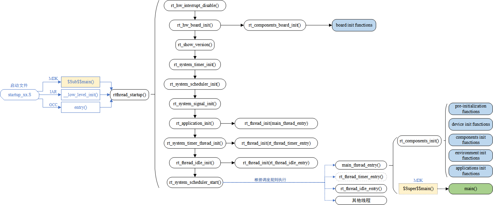
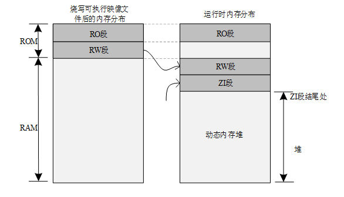

# rtthread rtos 学习

## RT-Thread 启动流程
一般了解一份代码大多从启动部分开始，同样这里也采用这种方式，先寻找启动的源头。RT-Thread 支持多种平台和多种编译器，而 rtthread_startup() 函数是 RT-Thread 规定的统一启动入口。一般执行顺序是：系统先从启动文件开始运行，然后进入 RT-Thread 的启动函数 rtthread_startup() ，最后进入用户入口函数 main()，如下图所示：


以 MDK-ARM 为例，用户程序入口为 main() 函数，位于 main.c 文件中。系统启动后先从汇编代码 startup_stm32f103xe.s 开始运行，然后跳转到 C 代码，进行 RT-Thread 系统启动，最后进入用户程序入口函数 main()。

为了在进入 main() 之前完成 RT-Thread 系统功能初始化，我们使用了 MDK 的扩展功能 $Sub$$ 和 $Super$$。可以给 main 添加 $Sub$$ 的前缀符号作为一个新功能函数 $Sub$$main，这个 $Sub$$main 可以先调用一些要补充在 main 之前的功能函数（这里添加 RT-Thread 系统启动，进行系统一系列初始化），再调用 $Super$$main 转到 main() 函数执行，这样可以让用户不用去管 main() 之前的系统初始化操作。

关于 $Sub$$ 和 $Super$$ 扩展功能的使用，详见 ARM® Compiler v5.06 for µVision®armlink User Guide。

下面我们来看看在 components.c 中定义的这段代码：

```C
/* $Sub$$main 函数 */
int $Sub$$main(void)
{
  rtthread_startup();
  return 0;
}

```

在这里 $Sub$$main 函数调用了 rtthread_startup() 函数，其中 rtthread_startup() 函数的代码如下所示：
```C
int rtthread_startup(void)
{
    rt_hw_interrupt_disable();

    /* 板级初始化：需在该函数内部进行系统堆的初始化 */
    rt_hw_board_init();

    /* 打印 RT-Thread 版本信息 */
    rt_show_version();

    /* 定时器初始化 */
    rt_system_timer_init();

    /* 调度器初始化 */
    rt_system_scheduler_init();

#ifdef RT_USING_SIGNALS
    /* 信号初始化 */
    rt_system_signal_init();
#endif

    /* 由此创建一个用户 main 线程 */
    rt_application_init();

    /* 定时器线程初始化 */
    rt_system_timer_thread_init();

    /* 空闲线程初始化 */
    rt_thread_idle_init();

    /* 启动调度器 */
    rt_system_scheduler_start();

    /* 不会执行至此 */
    return 0;
}

```
## RT-Thread 程序内存分布

Total RO Size (Code + RO Data) 53668 ( 52.41kB)
Total RW Size (RW Data + ZI Data) 2728 ( 2.66kB)
Total ROM Size (Code + RO Data + RW Data) 53780 ( 52.52kB)

1）RO Size 包含了 Code 及 RO-data，表示程序占用 Flash 空间的大小；

2）RW Size 包含了 RW-data 及 ZI-data，表示运行时占用的 RAM 的大小；

3）ROM Size 包含了 Code、RO-data 以及 RW-data，表示烧写程序所占用的 Flash 空间的大小；

程序运行之前，需要有文件实体被烧录到 STM32 的 Flash 中，一般是 bin 或者 hex 文件，该被烧录文件称为可执行映像文件。如下图左边部分所示，是可执行映像文件烧录到 STM32 后的内存分布，它包含 RO 段和 RW 段两个部分：其中 RO 段中保存了 Code、RO-data 的数据，RW 段保存了 RW-data 的数据，由于 ZI-data 都是 0，所以未包含在映像文件中。

STM32 在上电启动之后默认从 Flash 启动，启动之后会将 RW 段中的 RW-data（初始化的全局变量）搬运到 RAM 中，但不会搬运 RO 段，即 CPU 的执行代码从 Flash 中读取，另外根据编译器给出的 ZI 地址和大小分配出 ZI 段，并将这块 RAM 区域清零。

RT-Thread 内存分布



其中动态内存堆为未使用的 RAM 空间，应用程序申请和释放的内存块都来自该空间。

如下面的例子：

```C
rt_uint8_t* msg_ptr;
msg_ptr = (rt_uint8_t*) rt_malloc (128);
rt_memset(msg_ptr, 0, 128);
```

代码中的 msg_ptr 指针指向的 128 字节内存空间位于动态内存堆空间中。

而一些全局变量则是存放于 RW 段和 ZI 段中，RW 段存放的是具有初始值的全局变量（而常量形式的全局变量则放置在 RO 段中，是只读属性的），ZI 段存放的系统未初始化的全局变量，如下面的例子：

```C
#include <rtthread.h>

const static rt_uint32_t sensor_enable = 0x000000FE;
rt_uint32_t sensor_value;
rt_bool_t sensor_inited = RT_FALSE;

void sensor_init()
{
     /* ... */
}

```

## RT-Thread 自动初始化机制

自动初始化机制是指初始化函数不需要被显式调用，只需要在函数定义处通过宏定义的方式进行申明，就会在系统启动过程中被执行。

例如在串口驱动中调用一个宏定义告知系统初始化需要调用的函数，代码如下：

```C
int rt_hw_usart_init(void)  /* 串口初始化函数 */
{
     ... ...
     /* 注册串口 1 设备 */
     rt_hw_serial_register(&serial1, "uart1",
                        RT_DEVICE_FLAG_RDWR | RT_DEVICE_FLAG_INT_RX,
                        uart);
     return 0;
}
INIT_BOARD_EXPORT(rt_hw_usart_init);    /* 使用组件自动初始化机制 */

```
示例代码最后的 INIT_BOARD_EXPORT(rt_hw_usart_init) 表示使用自动初始化功能，按照这种方式，rt_hw_usart_init() 函数就会被系统自动调用，那么它是在哪里被调用的呢？

在系统启动流程图中，有两个函数：rt_components_board_init() 与 rt_components_init()，其后的带底色方框内部的函数表示被自动初始化的函数，其中：

“board init functions” 为所有通过 INIT_BOARD_EXPORT(fn) 申明的初始化函数。

“pre-initialization functions” 为所有通过 INIT_PREV_EXPORT(fn)申明的初始化函数。

“device init functions” 为所有通过 INIT_DEVICE_EXPORT(fn) 申明的初始化函数。

“components init functions” 为所有通过 INIT_COMPONENT_EXPORT(fn)申明的初始化函数。

“enviroment init functions” 为所有通过 INIT_ENV_EXPORT(fn) 申明的初始化函数。

“application init functions” 为所有通过 INIT_APP_EXPORT(fn)申明的初始化函数。

rt_components_board_init() 函数执行的比较早，主要初始化相关硬件环境，执行这个函数时将会遍历通过 INIT_BOARD_EXPORT(fn) 申明的初始化函数表，并调用各个函数。

rt_components_init() 函数会在操作系统运行起来之后创建的 main 线程里被调用执行，这个时候硬件环境和操作系统已经初始化完成，可以执行应用相关代码。rt_components_init() 函数会遍历通过剩下的其他几个宏申明的初始化函数表。

RT-Thread 的自动初始化机制使用了自定义 RTI 符号段，将需要在启动时进行初始化的函数指针放到了该段中，形成一张初始化函数表，在系统启动过程中会遍历该表，并调用表中的函数，达到自动初始化的目的。

用来实现自动初始化功能的宏接口定义详细描述如下表所示：

初始化顺序	宏接口	描述
1	INIT_BOARD_EXPORT(fn)	非常早期的初始化，此时调度器还未启动
2	INIT_PREV_EXPORT(fn)	主要是用于纯软件的初始化、没有太多依赖的函数
3	INIT_DEVICE_EXPORT(fn)	外设驱动初始化相关，比如网卡设备
4	INIT_COMPONENT_EXPORT(fn)	组件初始化，比如文件系统或者 LWIP
5	INIT_ENV_EXPORT(fn)	系统环境初始化，比如挂载文件系统
6	INIT_APP_EXPORT(fn)	应用初始化，比如 GUI 应用
初始化函数主动通过这些宏接口进行申明，如 INIT_BOARD_EXPORT(rt_hw_usart_init)，链接器会自动收集所有被申明的初始化函数，放到 RTI 符号段中，该符号段位于内存分布的 RO 段中，该 RTI 符号段中的所有函数在系统初始化时会被自动调用。

## RT-Thread 内核对象模型

RT-Thread 内核采用面向对象的设计思想进行设计，系统级的基础设施都是一种内核对象，例如线程，信号量，互斥量，定时器等。内核对象分为两类：静态内核对象和动态内核对象，静态内核对象通常放在 RW 段和 ZI 段中，在系统启动后在程序中初始化；动态内核对象则是从内存堆中创建的，而后手工做初始化。

以下代码是一个关于静态线程和动态线程的例子：

```C
/* 线程 1 的对象和运行时用到的栈 */
static struct rt_thread thread1;
static rt_uint8_t thread1_stack[512];

/* 线程 1 入口 */
void thread1_entry(void* parameter)
{
     int i;

    while (1)
    {
        for (i = 0; i < 10; i ++)
        {
            rt_kprintf("%d\n", i);

            /* 延时 100ms */
            rt_thread_mdelay(100);
        }
    }
}

/* 线程 2 入口 */
void thread2_entry(void* parameter)
{
     int count = 0;
     while (1)
     {
         rt_kprintf("Thread2 count:%d\n", ++count);

        /* 延时 50ms */
        rt_thread_mdelay(50);
    }
}

/* 线程例程初始化 */
int thread_sample_init()
{
     rt_thread_t thread2_ptr;
     rt_err_t result;

    /* 初始化线程 1 */
    /* 线程的入口是 thread1_entry，参数是 RT_NULL
     * 线程栈是 thread1_stack
     * 优先级是 200，时间片是 10 个 OS Tick
     */
    result = rt_thread_init(&thread1,
                            "thread1",
                            thread1_entry, RT_NULL,
                            &thread1_stack[0], sizeof(thread1_stack),
                            200, 10);

    /* 启动线程 */
    if (result == RT_EOK) rt_thread_startup(&thread1);

    /* 创建线程 2 */
    /* 线程的入口是 thread2_entry, 参数是 RT_NULL
     * 栈空间是 512，优先级是 250，时间片是 25 个 OS Tick
     */
    thread2_ptr = rt_thread_create("thread2",
                                thread2_entry, RT_NULL,
                                512, 250, 25);

    /* 启动线程 */
    if (thread2_ptr != RT_NULL) rt_thread_startup(thread2_ptr);

    return 0;
}

```

在这个例子中，thread1 是一个静态线程对象，而 thread2 是一个动态线程对象。thread1 对象的内存空间，包括线程控制块 thread1 与栈空间 thread1_stack 都是编译时决定的，因为代码中都不存在初始值，都统一放在未初始化数据段中。thread2 运行中用到的空间都是动态分配的，包括线程控制块（thread2_ptr 指向的内容）和栈空间。

静态对象会占用 RAM 空间，不依赖于内存堆管理器，内存分配时间确定。动态对象则依赖于内存堆管理器，运行时申请 RAM 空间，当对象被删除后，占用的 RAM 空间被释放。这两种方式各有利弊，可以根据实际环境需求选择具体使用方式。

## 线程

```C
/* 线程控制块 */
struct rt_thread
{
    /* rt 对象 */
    char        name[RT_NAME_MAX];     /* 线程名称 */
    rt_uint8_t  type;                   /* 对象类型 */
    rt_uint8_t  flags;                  /* 标志位 */

    rt_list_t   list;                   /* 对象列表 */
    rt_list_t   tlist;                  /* 线程列表 */

    /* 栈指针与入口指针 */
    void       *sp;                      /* 栈指针 */
    void       *entry;                   /* 入口函数指针 */
    void       *parameter;              /* 参数 */
    void       *stack_addr;             /* 栈地址指针 */
    rt_uint32_t stack_size;            /* 栈大小 */

    /* 错误代码 */
    rt_err_t    error;                  /* 线程错误代码 */
    rt_uint8_t  stat;                   /* 线程状态 */

    /* 优先级 */
    rt_uint8_t  current_priority;    /* 当前优先级 */
    rt_uint8_t  init_priority;        /* 初始优先级 */
    rt_uint32_t number_mask;

    ......

    rt_ubase_t  init_tick;               /* 线程初始化计数值 */
    rt_ubase_t  remaining_tick;         /* 线程剩余计数值 */

    struct rt_timer thread_timer;      /* 内置线程定时器 */

    void (*cleanup)(struct rt_thread *tid);  /* 线程退出清除函数 */
    rt_uint32_t user_data;                      /* 用户数据 */
};

```