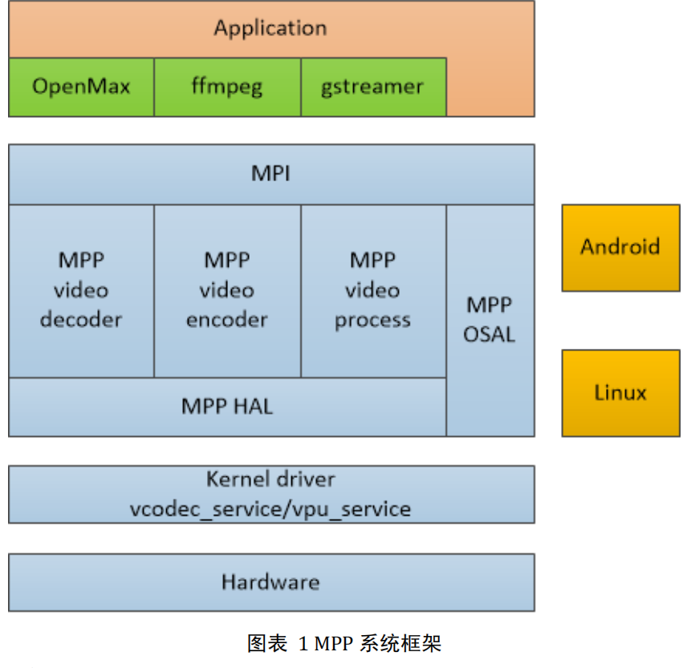
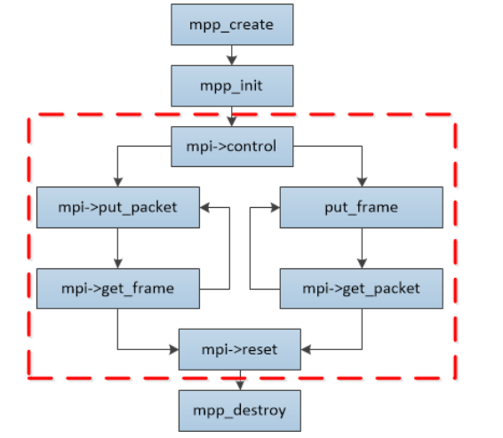

瑞芯微提供的媒体处理软件平台（Media Process Platform，简称 MPP）是适用于瑞芯微芯片系列的 
通用媒体处理软件平台。该平台对应用软件屏蔽了芯片相关的复杂底层处理，其目的是为了屏蔽不 
同芯片的差异，为使用者提供统一的视频媒体处理接口（Media Process Interface，缩写 MPI）。MPP 
提供的功能包括： 
1. 视频解码 
2. H.265 / H.264 / H.263 / VP9 / VP8 / MPEG-4 / MPEG-2 / MPEG-1 / VC1 / MJPEG 
3. 视频编码 
4. H.264 / VP8 / MJPEG 
5. 视频处理 
6. 视频拷贝，缩放，色彩空间转换，场视频解交织（Deinterlace） 

