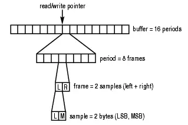
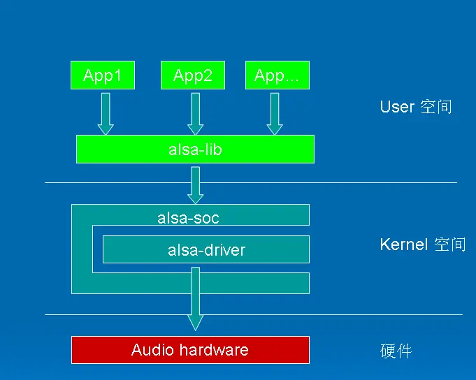

## 基础知识

> 采样就是每隔一定时间就读一次声音信号的幅度，从本质上讲，采样是时间上的数字化。
> 量化则是将采样得到的声音信号幅度转换为数字值，从本质上讲，量化则是幅度上的数字化


## 接口
```c
int snd_pcm_info(snd_pcm_t *pcm, snd_pcm_info_t *info);
int snd_pcm_hw_params_current(snd_pcm_t *pcm, snd_pcm_hw_params_t *params);
int snd_pcm_hw_params(snd_pcm_t *pcm, snd_pcm_hw_params_t *params);
int snd_pcm_hw_free(snd_pcm_t *pcm);
int snd_pcm_sw_params_current(snd_pcm_t *pcm, snd_pcm_sw_params_t *params);
int snd_pcm_sw_params(snd_pcm_t *pcm, snd_pcm_sw_params_t *params);
int snd_pcm_prepare(snd_pcm_t *pcm);
int snd_pcm_reset(snd_pcm_t *pcm);
int snd_pcm_status(snd_pcm_t *pcm, snd_pcm_status_t *status);
int snd_pcm_start(snd_pcm_t *pcm);
int snd_pcm_drop(snd_pcm_t *pcm);
int snd_pcm_drain(snd_pcm_t *pcm);
int snd_pcm_pause(snd_pcm_t *pcm, int enable);
snd_pcm_state_t snd_pcm_state(snd_pcm_t *pcm);
```

```bash
33848917:>>>>>(AlsaUtil.c) 240:     szDeviceName:plughw:3,0
33848917:>>>>>(AlsaUtil.c) 241:     enFormat:S16_LE
33848918:>>>>>(AlsaUtil.c) 242:     enAccess:RW_INTERLEAVED
33848918:>>>>>(AlsaUtil.c) 243:     enSampleRate:48000(unit: Hz)
33848918:>>>>>(AlsaUtil.c) 244:     enSoundMode:8
33848918:>>>>>(AlsaUtil.c) 245:     iDir:0
33848918:>>>>>(AlsaUtil.c) 246:     uiBufferTime:100000(unit: microsecond)
33848919:>>>>>(AlsaUtil.c) 247:     uiPeriodTime:10000(unit: microsecond)
33848919:>>>>>(AlsaUtil.c) 248:     ulBufferSize:4800(unit: frame)
33848919:>>>>>(AlsaUtil.c) 249:     ulPeriodSize:480(unit: frame)
```


## 数据量含义

8通道
16 bit  两个字节 

一秒48000个采样帧

总缓存为100ms   一个片段的缓存为10ms   480个采样帧
周期为10 

480 *8   就是每次播放所需要的数据量   




